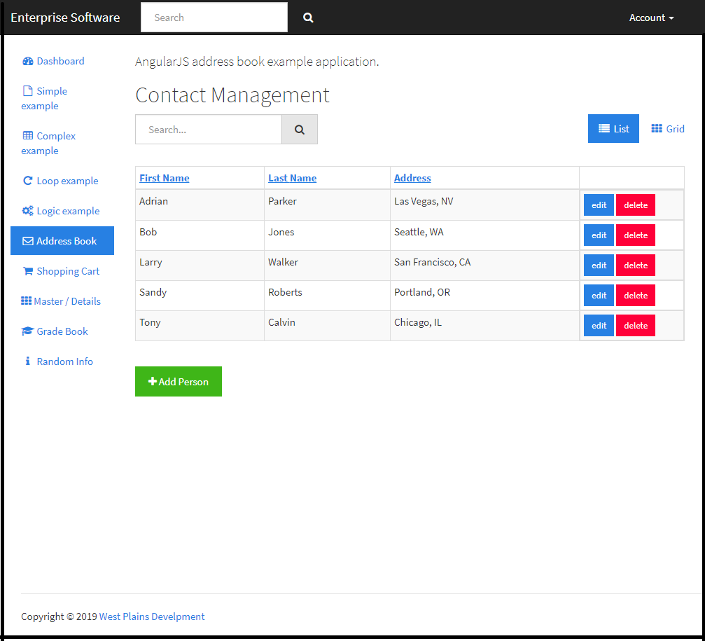

# admin-dashboard-panel

This is a Node.js, Express, Handlebars and AngularJS Dashboard example application. It includes several examples of Handlebar templating along with a form which posts back to an Express endpoint. Last, we have a few Angular Single Page Applications wired up to demonstrate the plug and play ability of this framework. Use this application shell as a starting point to create your own application.

## Instructions

To run the application, from the command line run:
`npm install`

To launch the application, again from the command line:
`npm start`

The application is configured to run on `Port 3010`
